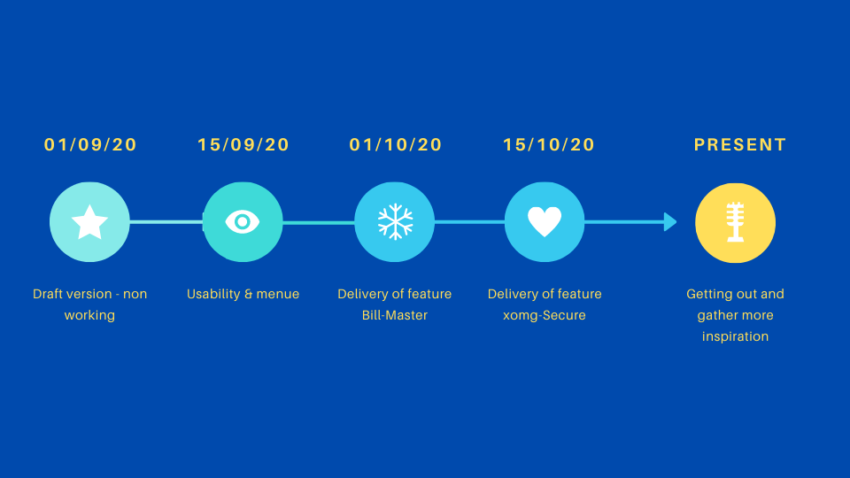

# Welcome to the AWS Buddy Project

This project is about giving owners of an AWS Account more control over thier account in a easy way.


 * Features
   - Overview of all costs this year and current costs
   - Securing the account (Checking status, enabling & configuring AWS SecurityHub)

## Getting started

 - Install python3
 - Install pip
 - git clone git@github.com:ZDF-UG/awsbuddy.git
 - pip install -r requirements.txt

Just run awsbuddy.py and follow the menu flow.

```
python3 awsbuddy.py
```
## Our release plan for the Year 2020
Disclaimer:
Right now AWS Buddy is at 0. It does not work and will start to work as soon as we reached the first milestone.

